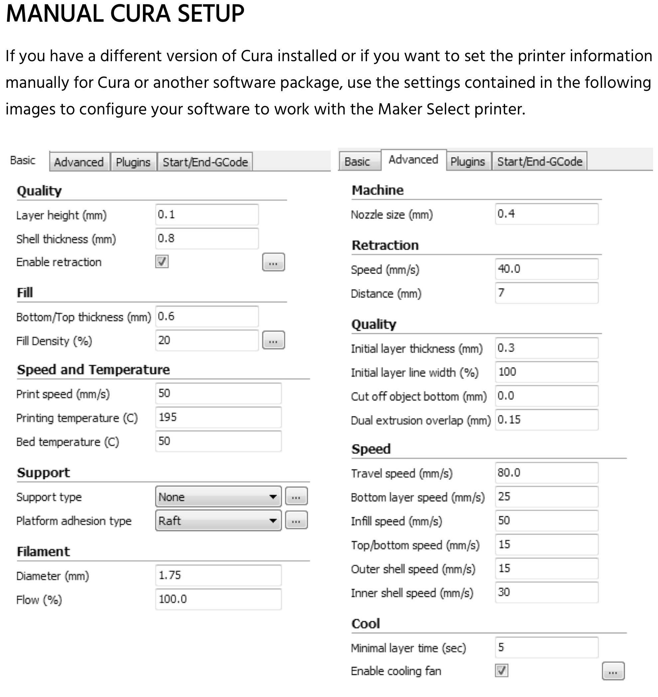

Monoprice Maker Ultimate 3D Printer MK11 Direct Drive Extruder / 24V Power System
---------------------------------------------------------------------------------

Notes on setup/configuration for this Wanhao Duplicator 6 clone.
Interestingly, it appears the Wanhao firmware is used in the Monoprice.
The manual also uses this name “Maker Select Pro Ultimate 3D” for the
printer. Specific experience with an open box model is
[here](./open-box-experience.md).

-   Name: Monoprice Maker Ultimate 3D Printer, MK11 direct drive
    extruder / 24V power system.
-   Rear tag: Monoprice Maker Select Pro Ultimate 3D Printer
-   Part no: 15710
-   Firmware: DEV 3.01
-   Processor: Arduino Mega 2560 (as reported by System Info)

Status when unpacked:

-   Machine on: 21:06
-   Printing: 7:05
-   Material: 12m

Tools
-----

-   [1mm feeler gauge](https://www.mcmaster.com/2283a26)
-   [0.004" feeler gauge](https://www.mcmaster.com/20385a34)
-   9mm 1/4" socket w/speed thumb wheel on ratchet
-   Smooth jaw pliers
-   [0.015" dia High-Speed M2 Tool Steel
    Rod](https://www.mcmaster.com/3009a297) for unclogging nozzle. Will
    compare effectiveness to sewing needle.

Filaments
---------

See [filaments.md](./filaments.md) for settings and experience with
different materials.

Profiles
--------

See [profiles.md](./profiles.md) saved printer profiles which include
stock and custom ones.

Printer Settings & Tuning
-------------------------

*Likely to move to its own page*

The build leveling function does not offer a way to cancel out once
started. There is no built-in feature to review the bed levelness.

Calibration
-----------

Anytime a piece of your printing environment changes, a recalibration of
your printer is needed. If a phyical component is changed, **always**
check the bed level. If the filament is changed, checking the
temperatures and extrusion number is well advised.

### Steps:

Easiest to start with PLA filament because it’s the most forgiving.

1.  Check build level using the printer’s LCD menu option
2.  &lt;&lt;Select a slicer program - add more details&gt;&gt;
3.  Create a slicer profile based on Monoprice’s info
    .

### Test Objects

*This section will be updated based on experiences w/using these tests*

Be sure to read the instructions for which settings to use.

-   [The Essential Calibration
    Set](https://www.thingiverse.com/thing:5573)
-   [XY 20 mm Calibration Box](https://www.thingiverse.com/thing:298812)
-   [All In One 3D Printer
    test](https://www.thingiverse.com/thing:2656594) or the [micro sized
    version](https://www.thingiverse.com/thing:2975429) or the [mini
    sized version](https://www.thingiverse.com/thing:2806295)
-   [Benchy](https://www.thingiverse.com/thing:763622)
-   [Bed Leveling Calibration Test Object
    (Parametric)](https://www.thingiverse.com/thing:34558)
-   [Print Temperature Calibration
    Piece](https://www.thingiverse.com/thing:35088)
-   [Deterministic Retraction
    Calibration](https://www.thingiverse.com/thing:1065179)
-   [Part Fitting Calibration](https://www.thingiverse.com/thing:342198)
-   [Test your 3D printer!
    v2](https://www.thingiverse.com/thing:1019228) Have not tried
    [v3](https://www.thingiverse.com/thing:1363023)

### Resources

These articles were used in calibrating this printer:

-   <a href="https://marlinfw.org/docs/configuration/configuration.html#sources-of-documentation" class="uri">https://marlinfw.org/docs/configuration/configuration.html#sources-of-documentation</a>
-   <a href="https://reprap.org/wiki/Triffid_Hunter%27s_Calibration_Guide" class="uri">https://reprap.org/wiki/Triffid_Hunter%27s_Calibration_Guide</a>
-   [3D Nation Guide](https://3dnation504795197.wordpress.com/guide/)
-   not used
    [Marlin3DprinterTool](https://github.com/cabbagecreek/Marlin3DprinterTool)

This info is unvetted:

-   <a href="https://www.youtube.com/watch?v=aYVuz9ccZL8" class="uri">https://www.youtube.com/watch?v=aYVuz9ccZL8</a>

Slicers & Firmware
------------------

The *slicer* is the software needed to turn a 3D model into G-code. The
printer’s *firmware* translates the G-code into control signals which
drive the printer’s different parts.

### Firmware

The Monoprice uses
[Marlin](https://marlinfw.org/docs/basics/introduction.html#what-is-marlin?).
Official support was added in ??build-get-reference??.

### Slicers

{fill-in}

G-code Details
--------------

There are variations in how each printer implements G-code. See
[RepRap](https://reprap.org/wiki/G-code) for the reference
specification. Refer to [this page](https://marlinfw.org/meta/gcode/)
for Marlin specifics.

Resources
---------

-   [Thingiverse
    collection](https://www.thingiverse.com/Printer3D_One/collections/wanhao-duplicator-6-d6-amp-monoprice-maker-ultimate-printed-parts-and-improvements)
    of various parts
-   [Monoprice
    manual](https://downloads.monoprice.com/files/manuals/15710_Manual_160622.pdf)
-   [Wanhao
    manual](http://www.wanhao3dprinter.com/xiazai/D6_User_Manual_REV_A.pdf).
    The Wanhao manual is easier to understand than the Monoprice one.

Modifications and Settings
--------------------------

-   [cnorth’s
    settings](https://www.thingiverse.com/groups/wanhao-duplicator-6/forums/general/topic:17580)
-   <a href="https://othermod.com/turn-a-monoprice-maker-ultimate-or-wanhao-duplicator-6-into-an-ultimaker-2/" class="uri">https://othermod.com/turn-a-monoprice-maker-ultimate-or-wanhao-duplicator-6-into-an-ultimaker-2/</a>

Do Dads
-------

-   [Filament spool clip](https://www.thingiverse.com/thing:42528)
-   [Creative Studio’s Smartphone Photo
    Studio](https://www.thingiverse.com/thing:1085472)
