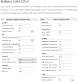

-   [Intro](#intro)
-   [The Printer](#the-printer)
-   [Maintenance Tools](#maintenance-tools)
-   [3D Filaments](#d-filaments)
-   [Profiles](#profiles)
-   [Printer Settings & Tuning](#printer-settings-tuning)
    -   [Bed Leveling and Z Axis 0](#bed-leveling-and-z-axis-0)
-   [Calibration](#calibration)
    -   [Steps:](#steps)
    -   [Notes on Building a Profile](#notes-on-building-a-profile)
    -   [Test Objects](#test-objects)
    -   [Resources](#resources)
-   [Slicers & Firmware](#slicers-firmware)
    -   [Slicers](#slicers)
-   [G-code Details](#g-code-details)
-   [Parts](#parts)
-   [Resources](#resources-1)
-   [Modifications and Settings](#modifications-and-settings)
-   [Doodads](#doodads)

Intro
-----

I’m trying a Git/markdown combo for all the info about setting up,
checking, and using this printer with the notion that our teenager could
learn a few aspects of software development.

The Printer
-----------

The printer’s full name is *Monoprice Maker Ultimate 3D Printer MK11
Direct Drive Extruder / 24V Power System*.

Notes on setup/configuration for this Wanhao Duplicator 6 clone which is
a clone of the Ultimaker 2. Interestingly, it appears the Wanhao
firmware is used in the Monoprice. The manual also uses this name “Maker
Select Pro Ultimate 3D” for the printer. Specific experience with an
open box model is [here](./open-box-experience.md).

-   Part no: 15710
-   Name: Monoprice Maker Ultimate 3D Printer, MK11 direct drive
    extruder / 24V power system.
-   Rear tag: Monoprice Maker Select Pro Ultimate 3D Printer
-   Processor: Arduino Mega 2560 (as reported by MacOS System Info)
-   Firmware flavor: [Marlin](https://marlinfw.org/)
-   Firmware version: DEV 3.01
-   Firmware source: The Wanhao firmware kept the Ultimaker strings in
    the `language.h` file.
    -   Wanhao:
        <a href="https://github.com/garychen99/Duplicator-6-firmware-version-3.1" class="uri">https://github.com/garychen99/Duplicator-6-firmware-version-3.1</a>
    -   From M115 G-code:
        <a href="https://github.com/Ultimaker/Ultimaker2Marlin" class="uri">https://github.com/Ultimaker/Ultimaker2Marlin</a>
-   G-codes implemented:
    <a href="https://github.com/garychen99/Duplicator-6-firmware-version-3.1#implemented-g-codes" class="uri">https://github.com/garychen99/Duplicator-6-firmware-version-3.1#implemented-g-codes</a>

The manuals are:

-   [Monoprice
    manual](https://downloads.monoprice.com/files/manuals/15710_Manual_160622.pdf)
-   [Wanhao
    manual](http://www.wanhao3dprinter.com/xiazai/D6_User_Manual_REV_A.pdf).
    The Wanhao manual is easier to understand than the Monoprice one.

Maintenance Tools
-----------------

-   [1mm feeler gauge](https://www.mcmaster.com/2283a26)
-   [0.004" feeler gauge](https://www.mcmaster.com/20385a34)
-   9mm 1/4" socket w/speed thumb wheel on ratchet
-   Smooth jaw pliers
-   [0.015" dia High-Speed M2 Tool Steel
    Rod](https://www.mcmaster.com/3009a297) for unclogging nozzle. Will
    compare effectiveness to sewing needle.

3D Filaments
------------

See [filaments.md](./filaments.md) for settings and experience with
different materials.

Profiles
--------

See [profiles.md](./profiles.md) saved printer profiles which include
stock and custom ones.

Printer Settings & Tuning
-------------------------

*Likely to move to its own page*

### Bed Leveling and Z Axis 0

The build leveling function does not offer a way to cancel out once
started. There is no built-in feature to review the bed levelness. You
can do this with g-code {add details from my file}.

To-do list:

-   <a href="https://3dprinting.stackexchange.com/questions/7264/how-to-set-the-z-home-offset" class="uri">https://3dprinting.stackexchange.com/questions/7264/how-to-set-the-z-home-offset</a>

Calibration
-----------

Anytime a piece of your printing environment changes, a recalibration of
your printer is needed. If a phyical component is changed, **always**
check the bed level. If the filament is changed, checking the
temperatures and extrusion number is well advised.

### Steps:

Easiest to start with PLA filament because it’s the most forgiving.

1.  Check build level using the printer’s LCD menu option
2.  &lt;&lt;Select a slicer program - add more details&gt;&gt;
3.  Create a slicer profile based on Monoprice’s info
    .

### Notes on Building a Profile

*This section is a work-in-progress*

Both Cura and PrusaSlicer offer a couple of different ways to store
settings for future use.

PrusaSlicer only provides profiles for its own printers. Here are some
notes on how I made ones for the Monoprice.

1.  Fine tuning hotend temperature, this [Temperature
    Tower](https://www.thingiverse.com/thing:2092820) was sliced and
    then the g-code edited to insert the commands to change the
    temperature. All files are
    [here](https://github.com/dgabbe/3D-test-objects/tree/master/TempTower).

To-do list:

-   See Configuration.h for feed, speed, and acceleration values
    starting at line 364. `m501` will read the EEPROM values.
-   Add details from
    <a href="https://hackaday.com/2016/08/30/review-monoprice-maker-ultimate-3d-printer/" class="uri">https://hackaday.com/2016/08/30/review-monoprice-maker-ultimate-3d-printer/</a>
    around speeds. The position precision in the X and Y axes are 12.5
    micron, in the Z is 5 micron. Suggested settings: x/y acceleration:
    2K - 3K mm/sec2 print speed: 100mm/sec (down from 150mm/sec).
    Limiting factor is if the hotend can deliver enough filament. At
    300mm/sec and 0.1mm layer height the extruder started stripping the
    filament.
-   <a href="https://pinshape.com/blog/10-advanced-3d-slicer-settings-that-will-save-your-prints/" class="uri">https://pinshape.com/blog/10-advanced-3d-slicer-settings-that-will-save-your-prints/</a>
-   <a href="https://www.thingiverse.com/groups/wanhao-duplicator-6/forums/general/topic:17580" class="uri">https://www.thingiverse.com/groups/wanhao-duplicator-6/forums/general/topic:17580</a>
-   <a href="http://projects.ttlexceeded.com/3dprinting_maintenance.html" class="uri">http://projects.ttlexceeded.com/3dprinting_maintenance.html</a>
-   <a href="https://toms3d.org/2014/07/07/3d-printing-guides-tuning-speeds" class="uri">https://toms3d.org/2014/07/07/3d-printing-guides-tuning-speeds</a>
-   Interesting
    [discussion](https://www.thingiverse.com/groups/i3/forums/general/topic:5539)
    on calibrating the extruder and
    [this](https://groups.google.com/forum/m/#!topic/wanhao-printer-3d/--RCeFXZmFk)
-   Errata: 1000 micron (micrometer) = 1mm; 1 micron = 0.001mm
-   Layer resolution: Ultra high: 20 micron; High: 60 micron; Medium:
    100 micron; Low: 200 micron

### Test Objects

*This section will be updated based on experiences w/using these tests*

Be sure to read the instructions for which settings to use.

-   [The Essential Calibration
    Set](https://www.thingiverse.com/thing:5573)
-   [XY 20 mm Calibration Box](https://www.thingiverse.com/thing:298812)
-   [All In One 3D Printer
    test](https://www.thingiverse.com/thing:2656594) or the [micro sized
    version](https://www.thingiverse.com/thing:2975429) or the [mini
    sized version](https://www.thingiverse.com/thing:2806295)
-   [Benchy](https://www.thingiverse.com/thing:763622)
-   [Bed Leveling Calibration Test Object
    (Parametric)](https://www.thingiverse.com/thing:34558)
-   [Print Temperature Calibration
    Piece](https://www.thingiverse.com/thing:35088)
-   [Deterministic Retraction
    Calibration](https://www.thingiverse.com/thing:1065179)
-   [Part Fitting Calibration](https://www.thingiverse.com/thing:342198)
-   [Test your 3D printer!
    v2](https://www.thingiverse.com/thing:1019228) Have not tried
    [v3](https://www.thingiverse.com/thing:1363023)

### Resources

These articles were used in calibrating this printer:

-   <a href="https://marlinfw.org/docs/configuration/configuration.html#sources-of-documentation" class="uri">https://marlinfw.org/docs/configuration/configuration.html#sources-of-documentation</a>
-   <a href="https://reprap.org/wiki/Triffid_Hunter%27s_Calibration_Guide" class="uri">https://reprap.org/wiki/Triffid_Hunter%27s_Calibration_Guide</a>
-   [3D Nation Guide](https://3dnation504795197.wordpress.com/guide/)
-   not used
    [Marlin3DprinterTool](https://github.com/cabbagecreek/Marlin3DprinterTool)

This info is unvetted:

-   <a href="https://www.youtube.com/watch?v=aYVuz9ccZL8" class="uri">https://www.youtube.com/watch?v=aYVuz9ccZL8</a>

Slicers & Firmware
------------------

The *slicer* is the software needed to turn a 3D model into G-code. The
printer’s *firmware* translates the G-code into control signals which
drive the printer’s different parts.

### Slicers

-   Info on customizing Cura w/[definition
    files](https://github.com/Ultimaker/Cura/wiki/Definition-Files-Explained)
-   Details for
    [PrusaSlicer](http://projects.ttlexceeded.com/3dprinting_prusaslicer.html)
    and
    <a href="https://forum.prusaprinters.org/forum/english-forum-general-discussion-announcements-and-releases/prusaslicer-ini-docs/" class="uri">https://forum.prusaprinters.org/forum/english-forum-general-discussion-announcements-and-releases/prusaslicer-ini-docs/</a>
-   [PrintRun
    tutorial](https://all3dp.com/2/printrun-a-beginner-s-tutorial/) -
    may need to move out of this section.

G-code Details
--------------

There are variations in how each printer implements G-code. See
[RepRap](https://reprap.org/wiki/G-code) for the reference
specification. Refer to [this page](https://marlinfw.org/meta/gcode/)
for Marlin specifics. [G-code
viewer](https://github.com/hudbrog/gCodeViewer).

Parts
-----

-   [Micro-Swiss](https://store.micro-swiss.com/collections/wanhao-duplicator-6)
-   [Ultimate 3D Printing
    Store](https://ultimate3dprintingstore.com/collections/wanhao-duplicator-6-parts-department)
-   [BuildTak](https://www.buildtak.com/product-category/shop/).
    Monoprice support said the bed surface was PEI sheet.

Resources
---------

-   [Marlin
    Intro](https://marlinfw.org/docs/basics/introduction.html#what-is-marlin?)
-   [Duplicator 6 Community
    Wiki!](https://3dprint.wiki/reprap/wanhao/duplicator6) as of March
    2020, it is being ported over from [Google
    Sites](https://sites.google.com/site/duplicator6/)
-   [Thingiverse
    collection](https://www.thingiverse.com/Printer3D_One/collections/wanhao-duplicator-6-d6-amp-monoprice-maker-ultimate-printed-parts-and-improvements)
    of various parts

Modifications and Settings
--------------------------

-   [cnorth’s
    settings](https://www.thingiverse.com/groups/wanhao-duplicator-6/forums/general/topic:17580)
-   <a href="https://othermod.com/turn-a-monoprice-maker-ultimate-or-wanhao-duplicator-6-into-an-ultimaker-2/" class="uri">https://othermod.com/turn-a-monoprice-maker-ultimate-or-wanhao-duplicator-6-into-an-ultimaker-2/</a>
-   *Advanced:* [Add menu options to Marlin firmware LCD
    menu](https://3dprinting.stackexchange.com/questions/7676/)

Doodads
-------

-   [Filament
    spool clip](https://www.thingiverse.com/thing:42528)
-   [Creative
    Studio’s Smartphone Photo
    Studio](https://www.thingiverse.com/thing:1085472)
